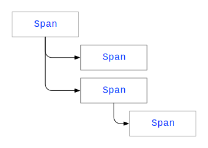

# Spans

The central interface in Natchez is the `Span`, which is a managed resource that records timing information and other details about its own lifetime. We perform computations within the lifetime of a span and thus gather timing information about these computations.

A `Span` can create child spans, whose lifetimes are bounded (usually!) by the lifetime of the parent. We can thus gather timing information for various phases of computation within a larger computation. Concurrent computations may have many active child spans.

Spans thus form a **tree**.



Each `Span` (in addition to a parent, name, intrinisic timing information, and other back-end-specific data) contains a string-keyed map of `TraceValue`s (strings, booleans, and numbers) for arbitrary user-defined information.

A `Span` can provide a hunk of data called a `Kernel`, which can be sent to a remote computer, typically via HTTP headers. The remote computer can then create child spans that will be linked with the originating span by the tracing back-end. Tracing is thus **distributed**.

## Passing Spans Around

_The examples in this section use the following imports:_
```scala mdoc
import cats.Monad
import cats.effect.IO
import cats.syntax.all._
import natchez.{ Span, Trace }
```

There are two strategies for keeping track of the current span.

### Explicit Span

The simple (but verbose) strategy for knowing what the current span is, is to pass one as an argument to any method that needs to do tracing. For example:

```scala mdoc
def wibble(name: String, age: Int, parent: Span[IO]): IO[Unit] =
  parent.span("wibble").use { span =>
    for {
      _ <- span.put("name" -> name, "age" -> age)
      // ... actual method logic in IO
    } yield ()
  }
```

This approach might make sense if you're using a concrete effect type with no "reader" capability (like `IO` with Cats-Effect 2).

### Ambient Span

A nicer way to pass the current span around is to use the `Trace` constraint, which ensures that there is always a current span. With this strategy you never have see `Span` reference at all, but instead use the `Trace` instance directly.

```scala mdoc
def wibble[F[_]: Trace: Monad](name: String, age: Int, parent: Span[F]): F[Unit] =
  Trace[F].span("wibble") {
    for {
      _ <- Trace[F].put("name" -> name, "age" -> age)
      // ... actual method logic in F
    } yield ()
  }
```

Use this strategy if you're programming in tagless style (i.e., abstract effect `F`) or if you're using a concrete data type with "reader" capabilities (like `IO` Cats-Effect 3).

See the @ref:[reference](trace.md) for more information on the `Trace` constraint.

## Span Properties

All spans have the following intrinisic properties, all of which return _vendor-specific_ values.

| Property   | Meaning                                                                                                                                               |
|------------|-------------------------------------------------------------------------------------------------------------------------------------------------------|
| `spanId`   | An opaque string identifier that uniquely identifies a span.                                                                                          |
| `traceUri` | A URI where a user can view the trace using the back end's GUI.                                                                                       |
| `kernel`   | A map of values that can be sent to a remote computer, allowing it to continue this trace. See the @ref:[reference](kernels.md) for more information. |

These fields are available on `Span` instances if you're passing them explicitly, and directly the `Trace` effect if you're using ambient spans.

## Span Fields

All spans have an internal map of string tag +`TraceValue` pairs called **fields**.

- You can add a field to a span via the `put` method on `Span` or `Trace`.
- Fields are write-only. There is no way to inspect a span's fields.

Some field tags are meaningful to tracing back-ends in a vendor-specific way. These include internal trace/span identifiers, timing information, indication of errors, and so on. These fields are added automatically during the span's lifetime

Some field tags are "standard", in the sense that they are recommended by emerging standards (OpenTracing, OpenTelemetry). Back ends recognize these fields sporadically. You can construct fields that use these standard tags via the `Tags` object.

Other field tags are arbitrary strings that you can create as you wish. Most tracing back ends allow you to query for traces/spans base on these tags, and display them in a table when viewing a span.

## Constructing Spans

Most spans are **child spans** created via the `span` method on an existing `Span` or `Trace` instance.

- When using explicit spans, the child is presented as a `Resource` that you `use`.
- When using ambient spans, the child span constructor takes a continuation to execute in the context of the child span.

**Root spans** and **continued spans** are constructed via an `EntryPoint`.

- A **root span** has no parent, and is typically constructed when a new externel web request is received.
- A **continued span** has a parent on another computer, and is typically constructed when a new internal request is received.

See the @ref:[reference](entrypoints.md) for more information on `EntryPoint`.


